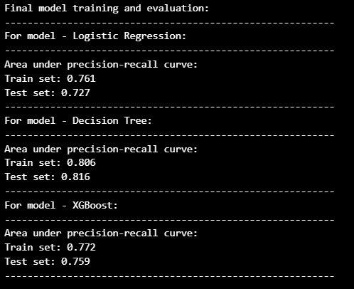

# Credit Card Transaction Fault Detection  
## ✨ What you will find within this project  
- Exploratory Data Analysis (EDA), Feature Engineering, and Feature Selection.
- Handling class imbalance (class weight balancing, ADASYN, SMOTE), PCA, creating custom scorers, and using FunctionTransformer, ColumnTransformer, and Pipelines.
- Experimentation with different techniques for class imbalance handling, feature engineering, and feature selection. **A demonstration of how the performance of the Decision Tree model improved by 24.45%.**
- Predictive modeling using Logistic Regression, Decision Tree, and XGBoost.
- Feature importance analysis, precision-recall curve, and visualization of decision tree graphs.
- Cross-validation with randomized search and grid search for hyperparameter tuning.
- **End-to-end deployment on AWS Cloud using GitHub Actions, AWS ECR, and AWS App Runner.**
- Flask web app interface for training models on new data and making predictions. Users can manually adjust predictor variables and observe the model's predictions.
- Dockerfile for creating Docker images.
- Version control with Git and GitHub.
- Modular coding with proper documentation.
- Custom functions and classes for enhanced modularity and reusability.

## 🧐 About the Problem Statement  
In the golden age of the internet and AI, opportunities and information grow daily. People can work remotely, transfer money instantly, leverage AI tools, and even start online businesses. However, this progress brings challenges like UPI payment scams, job scams, AI deep fakes, and more.

As more people use the internet for transactions and entertainment (e.g., online shopping, restaurant bookings, social media), the risk of fraud increases, requiring proactive measures to identify and prevent these incidents early.


Credit card fraud is a growing problem. The Nilson Report projects losses could reach $38.5 billion by 2027. Fraud can occur through RFID cloning, physical theft, data leaks, fake calls impersonating banks, or identity theft. Despite the methods, fraudulent transactions typically deviate significantly from a user's usual behavior.

Using big data (customer transaction data) and machine learning (ML), patterns in fraudulent transactions can be identified, helping credit card issuers deny such transactions or require stronger verification. Early detection benefits include:

1. Financial protection for cardholders and institutions.
2. Improved customer trust and company reputation.
3. Legal compliance.
4. Insights into fraud patterns to spread awareness and develop prevention strategies.

## 📈 About the Dataset  
**Information as provided by the dataset creator:**  
The dataset contains transactions made by credit cards in September 2013 by European cardholders.  

This dataset presents transactions that occurred in two days, where we have 492 frauds out of 284,807 transactions. The dataset is highly unbalanced, the positive class (frauds) account for 0.172% of all transactions.  

It contains only numerical input variables which are the result of a PCA transformation. Unfortunately, due to confidentiality issues, we cannot provide the original features and more background information about the data. Features V1, V2, … V28 are the principal components obtained with PCA, the only features which have not been transformed with PCA are 'Time' and 'Amount'. Feature 'Time' contains the seconds elapsed between each transaction and the first transaction in the dataset. The feature 'Amount' is the transaction Amount, this feature can be used for example-dependant cost-sensitive learning. Feature 'Class' is the response variable and it takes value 1 in case of fraud and 0 otherwise.  

The dataset has been collected and analysed during a research collaboration of Worldline and the Machine Learning Group (http://mlg.ulb.ac.be) of ULB (Université Libre de Bruxelles) on big data mining and fraud detection.  

Dataset link: https://www.kaggle.com/datasets/mlg-ulb/creditcardfraud

## 🔡 A quick look at the dataset

The dataset has 284,807 rows and 31 columns, with 1,081 duplicate rows dropped from the analysis. There are no missing values.  


All the columns are numeric in nature.  

### Dataset Columns:
1. **Time:** Elapsed seconds between the current and the first transaction.
2. **V1 to V28:** PCA-transformed features (confidential).
3. **Amount:** Transaction amount (likely in Euros).
4. **Class:** Target variable (1: fraud, 0: genuine).


The dataset exhibits significant class imbalance.

## 📚 Kaggle Notebooks  
- **Part-1 | EDA, Feature Engineering, and Feature Selection:** [Link](https://www.kaggle.com/code/ayushsharma0812/part-1-eda-feature-engg-and-feature-selection)
- **Part-2 | Predictive Modeling (24% performance boost):** [Link](https://www.kaggle.com/code/ayushsharma0812/part-2-predictive-modeling-24-performance-boost)

## 🛠️ Tech Stack Used
- **Programming Languages:** Python
- **Libraries:** numpy, pandas, matplotlib, seaborn, scipy, statsmodels, scikit-learn, imblearn, xgboost
- **Web Framework:** Flask
- **Version Control:** Git, GitHub
- **Containerization:** Docker
- **CI/CD:** GitHub Actions
- **Deployment:** AWS ECR, AWS App Runner
- **IDE/Editors:** VS Code, Jupyter Notebook

## 💪 Challenges Faced
- Writing modular code for the first time, including documentation, exception handling, and logging.
- Learning Flask and HTML for web app development. Used ChatGPT for coding, debugging, and adjustments.   

## 💻 Running the app on local system
1. **Environment setup**
```
conda create --prefix venv python==3.12.8 -y
conda activate venv/
````
2. **Install Requirements**
```
pip install -r requirements.txt
```
5. **Run Application.**
```
python app.py
```
Access the app at `localhost:5000`.

## 🐳 Building and using Docker Images
1. **Open your cmd and navigate to the app directory:**
```
cd app_py_file_directory
```
2. **Build the Docker Image:** 
```
docker build -t credit_card_fault_detector:0.0.1 .
```
3. **Run the Docker container:**
```
docker run --name credit_card_fault_detector -p host_port:5000 credit_card_fault_detector:0.0.1
```
Adjust host_port as per your suitability and use `localhost:host_port` to access the web app.
4. **Stop the container:**  
```
docker stop credit_card_fault_detector
```

## 🌐 Using the Web app
1. **Main Page:**


2. **Train Page:**


3. **Prediction Page:**


4. **Error Page:**


## 🗃️📂 Project Structure


## ⋙ Workflow for Jupyter Notebooks


## 💡 Key Insights and Results of Predictive Modeling

1. Amount column follows the Pareto principle.  


2. Amount column and V1 to V28 columns showed high skewness and thus, they were transformed using log10 transformations and cube root transformations respectively to make them more transform towards normal distribution. These feature engineering techniques proved to be beneficial in improving model performance.  

3. V13, V15 and V23 columns were removed through feature selection using statistical tests and this was verified through experimentation how including them actually led to reduction in performance.  

4. The maximum correaltion in terms of absolute value is 0.624 and that is between V21 and V22 after the cube root transformation. Since most of the columns were already PCA encoded they would have very low correlations and the same can be observed here for most of the pairs.  


5. Maximum VIF observed was for Time column which was 5.78 and thus, using a threshold of 10, no columns were dropped through multi-collinearity analysis. 

6. SMOTE outperformed ADASYN and class weight balancing for given problem statement.  

7. Due to the piecewise approximation nature of tree based models, they are negatively affected when decision boundaries are not parallel to predictor axis. Using PCA, this can be corrected in some cases and this technique proved to be helpful here to a good extent.  

8. The decision boundaries are simple in nature and not very complex as the decision tree depth observed is just 1 or 2 levels.  

9. Decision Tree models achieved the highest performance.    



10. V21 and V17 columns have the maximum effect on the target class prediction. While Time and V20 have the least importance.  


11. Comparing a decision tree model with SMOTE but no PCA, feature engineering and feature selection with a decision tree model which has feature engineering, feature selection and PCA the performance of model increased by 24.45% relatively.

## 🔗 References
- https://www.inscribe.ai/fraud-detection/credit-fraud-detection  
- https://seon.io/resources/credit-card-fraud-detection/
- https://www.kdnuggets.com/2023/01/7-smote-variations-oversampling.html
- https://www.analyticsvidhya.com/blog/2020/10/overcoming-class-imbalance-using-smote-techniques/#h-dealing-with-imbalanced-data
- https://scikit-learn.org/stable/
- https://www.youtube.com/@krishnaik06 
- Hands on Machine Learning with Scikit-Learn & TensorFlow by Aurélien Géron (O'Reilly). CopyRight 2017 Aurélien Géron
