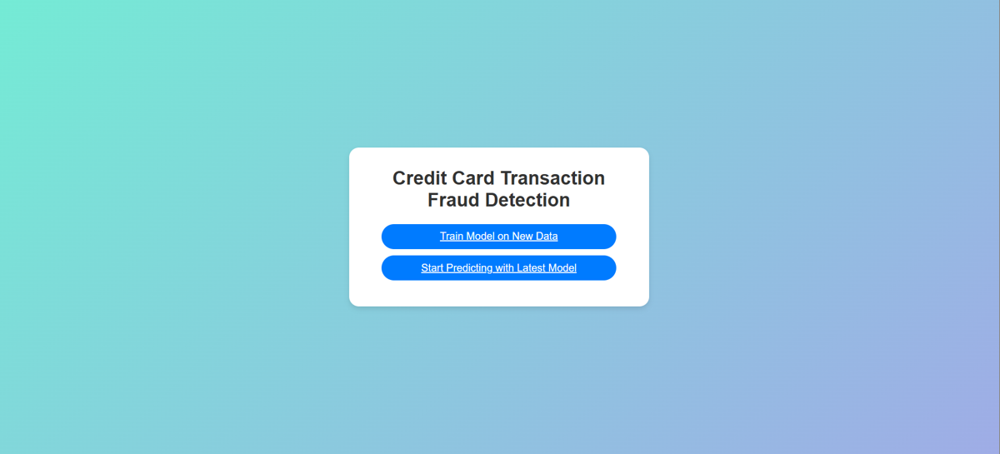

# Credit Card Transaction Fraud Detection Project Deployment

Once the app has been developed and tested on the local system by building a Docker image, the code needs to be pushed to GitHub.

To deliver our project to AWS ECR and run it via AWS App Runner, these steps need to be followed:

- #### [Create GitHub Actions YAML configuration file](#create-github-actions-yaml-configuration-file)  
- #### [Login to AWS Console](#login-to-aws-console)  
- #### [Define new user, if not defined](#define-new-user-if-not-defined)
- #### [Get access keys](#get-access-keys)  
- #### [Create an Amazon Elastic Container Registry (ECR)](#create-an-amazon-elastic-container-registry-ecr)  
- #### [Adding Secrets in GitHub](#adding-secrets-in-github)
- #### [Run web app using AWS App Runner](#run-web-app-using-aws-app-runner)  

These steps are explained in more detail below.

## Create GitHub Actions YAML configuration file

This is a GitHub Actions workflow written in YAML for continuous integration (CI) and continuous delivery (CD) of a software project. The deployment part is manually performed here, and the steps for that will be highlighted in the upcoming sections.  

Let's understand each part of the configuration file one by one.  

1. After assigning a name to the workflow, we define the conditions under which the workflow will be initiated. Here, it specifies that when a push is made to the main branch, the workflow starts, provided the push changes are not limited to `README.md` and/or the `Images` folder.
```yaml
name: workflow

on:
  push:
    branches:
      - main
    paths-ignore:
      - 'README.md'
      - 'Images/**'
```

2. Here, we define the permissions associated with the workflow.  
- `id-token: write` - Allows the GitHub Actions runner to request an OIDC token, facilitating secure authentication with external services like AWS by providing a verified identity token with relevant details about the workflow run.  
- `contents: read` - Grants the workflow read-only access to the repository data.  
- Any permissions not explicitly mentioned are by default set to `None`, meaning no read or write access.
```yaml
permissions:
  id-token: write
  contents: read
```

3. We define the jobs that need to take place when the workflow is initiated. The first step is `integration`. Integration refers to the process of automatically merging code changes from multiple developers into a shared main branch frequently, where each code change is immediately tested to ensure it integrates smoothly with the existing codebase. This prevents conflicts and identifies issues early in the development cycle. We define the integration of branches in this step. This is executed on an Ubuntu system with the latest version. The defined steps are:  
- `actions/checkout@v3`: Checks out to the GitHub workspace, allowing the workflow to access data.  
- `Linting`: This step analyzes code automatically to find errors and stylistic issues. For demonstration purposes, it is shown here as simply printing "Linting repository."  
- `Unit testing`: This step is used for automatically performing unit testing on the merged code. Again, for demonstration, it simply prints "Running Unit tests."
```yaml
jobs:
  integration:
    name: Continuous Integration
    runs-on: ubuntu-latest
    steps:
      - name: Checkout Code
        uses: actions/checkout@v3

      - name: Lint code
        run: echo "Linting repository"

      - name: Run unit tests
        run: echo "Running unit tests"
```

4. The second step after integration is continuous delivery (CD), where the workflow delivers the integrated and tested code to ECR on AWS after building the Docker image. The steps involved are:  
- `actions/checkout@v3`: Checks out the code to the workspace.  
- `aws-actions/configure-aws-credentials@v1`: Retrieves credentials from GitHub secrets.   
- `aws-actions/amazon-ecr-login@v1`: Logs in to Amazon ECR.  
- `build-image`: Builds, tags, and pushes the image to Amazon ECR. Using the provided commands, the Docker image is built and pushed to AWS ECR.
```yaml
  build-and-push-ecr-image:
    name: Continuous Delivery
    needs: integration
    runs-on: ubuntu-latest
    steps:
      - name: Checkout Code
        uses: actions/checkout@v3

      - name: Configure AWS credentials
        uses: aws-actions/configure-aws-credentials@v1
        with:
          aws-access-key-id: ${{ secrets.AWS_ACCESS_KEY_ID }}
          aws-secret-access-key: ${{ secrets.AWS_SECRET_ACCESS_KEY }}
          aws-region: ${{ secrets.AWS_DEFAULT_REGION }}

      - name: Login to Amazon ECR
        id: login-ecr
        uses: aws-actions/amazon-ecr-login@v1

      - name: Build, tag, and push image to Amazon ECR
        id: build-image
        env:
          IMAGE_TAG: latest
        run: |
          # Build a Docker container and
          # push it to ECR so that it can
          # be deployed to ECS.
          docker build -t ${{ secrets.AWS_ECR_REPO_URI }}:$IMAGE_TAG .
          docker push ${{ secrets.AWS_ECR_REPO_URI }}:$IMAGE_TAG
```

To use this workflow, copy the YAML code to a `.yml` file in your repository's `.github/workflows` directory.  

## Login to AWS Console

Login to the AWS console through the following link: [AWS Console Sign-In](https://console.aws.amazon.com/console/home?nc2=h_ct&src=header-signin). You can use either the root user or IAM user login.

## Define new user, if not defined, and get access keys

1. To create a new user, go to Identity and Access Management (IAM). Navigate to the "Users" tab under "Access Management" and click on `Create User`.


2. Assign a username to the user and click on `Next`. Optionally, you can grant access to the management console.  


3. Assign policies to the user that define their access and permissions. Options include: adding the user to a group with shared policies, copying settings from an existing user, or attaching AWS-managed policies directly to the user. In this example, administrator access is granted directly to the user.    


4. Review the details and click on `Create User`. Optionally, you can add tags to help search for the user faster when needed.  


5. Once the user is created (or if there is an existing user), navigate to the user and click on their `username`.  


6. Go to the "Security Credentials" tab and click on `Create Access Key`. This access key will be used by the GitHub workflow to log in to AWS.  


7. Choose the use case for which this access key will be used, tick the warning box, and click on `Next`. For running an application on AWS App Runner, you can choose the third option: "Application running on an AWS compute service."  


8. Optionally, add tags for easy searching of the access key and then click on `Create Access Key`.  


9. Copy the `Access Key` and the `Secret Access Key` as these will need to be stored as GitHub secrets, allowing the GitHub workflow to connect with AWS. Alternatively, you can download the keys as a CSV file.  


## Create an Amazon Elastic Container Registry (ECR)

Amazon Elastic Container Registry (ECR) is a fully managed container registry that makes it easy to store, manage, share, and deploy container images and artifacts. Images stored here can be easily transferred to other applications to run them as containers. For our application, GitHub Actions will generate the Docker image and push it to ECR for storage, from where it will be fetched by AWS App Runner.  

1. From the AWS Management Console, go to "Amazon Elastic Container Registry (ECR)" and click on `Create Repository`. This will initiate the creation of a private repository. If needed, you can create a public repository. Amazon ECR Public allows public sharing of container software for anyone to download. Anyone with or without an AWS account can search the Amazon ECR Public Gallery for public container software and pull artifacts for use.  

2. Add a repository name and click on `Create`. Optionally, provide a namespace to group different repositories together. The namespace/repo-name format can be used. Following options can also be configured:  
- `Image tag mutability`: Defines whether the image tags can be overwritten.  
- `Encryption`: Specify the encryption configuration.  
- `Region`: Specify the region from the top-right corner. The selected region will determine where the repository is valid.  


3. Once the repository is created, you will see a page like this. Copy the repository URI, as it will be used as a GitHub secret. This URI informs the GitHub Actions workflow where to push the Docker image.  


In the repository URI or the top-right corner, the region code for the repository is displayed. In this example, the region is "Asia Pacific (Mumbai)," with the region code `ap-south-1`. This code needs to be copied for GitHub secrets. It can also be extracted from the URI.

## Adding Secrets in GitHub

1. Navigate to the GitHub repository where you want to add the secrets (i.e., your project repository).  

2. Click on the `Settings` tab in the menu bar.  


3. Scroll down and click on `Actions` within the "Secrets and Variables" section on the left side of the page.  


4. Click on `New Repository Secret` to add a new secret.  


5. Add the secret's name (`AWS_ACCESS_KEY_ID`, as mentioned in the YAML configuration file) and paste the value into the "Secret" text box. Click on `Add Secret`.  


Similarly, add the following secrets:  
- `AWS_SECRET_ACCESS_KEY`: User's secret access key.   
- `AWS_ECR_REPO_URI`: Repository URI.    
- `AWS_DEFAULT_REGION`: Repository region code (e.g., `ap-south-1`).

6. To automate future deployments, ensure all necessary GitHub secrets have been added. Once secrets are configured, the GitHub Actions workflow will use these credentials to push Docker images to the Amazon Elastic Container Registry.

## Run Web App Using AWS App Runner

AWS App Runner is a fully AWS managed service that makes it easy for developers to deploy from source code or container image directly to a scalable and secure web application.

1. Go to AWS App Runner and click on `Create an app runner service`.  

2. In source and deployment, we can define from where the source code or container for web app deployment comes from and how it will be deployed. For my porblem statement, I have chosen following options:  

**In Source settings:**  
- `Repository type`: Since I am trying to use Docker image, a Docker container will run within the App Runner. So, I have chosen Container Registry.  
- `Provider`: Here, we need to define whether the container registry is private or public. Mine is private.  
- `Container Image URI`: This is simply the ECR URI ID that we exxtracted for GitHub secrets. This will tell the App Runner the exact ECR it needs to connect to.  

**In Deployment settings:**  
- `Deployment trigger`: This defines whether if the image contained in ECR changes then should the changes be made accordingly in App Runner automatically or you want to perform it manually.  
- `ECR access role`: The role gives access to App Runner for accessing ECR. For new role, name can be given, this creates a new role in IAM with attached AWS managed policy for ECR access.  


3. Now, we need to define the configuration of the machine that will be used to run the app and then click on 'Next`. We can define multiple things:  
- `Service settings`: Here, we define the CPU and memory configuration of the system that will be used to run the app. I have chosen the minimum configuration as the app is not too heavy. Also, we need to give the port on which the app will be running inside the container. For my codebase, I have setup 500 as the port in app.py.  
- `Auto scaling`: If the number of requests keeps on increasing then how should that load be balnced by adding new instances or systems.  
- `Health Check`: Configure how the load balancers will be checked and what will be the frequency of those checks and threshold.  
- `Safety`: We can define settings related to the safety of the system.  
- `Networking`: Configure the way your service communicates with other applications, services, and resources.  
- `Observability`: Configure observability tooling. This will help us keep an eye on how things are performing within the App Runner instance.  
- `Tags`: We can add tags for easier searchability of the application.  

Apart from Service settings, I have kept the default settings for rest of the settings.


4. In the last step, review the settings that you have set and if everything is ok. Click on 'Create & Deploy`.

5. Once you have deployed the container via App Runner. You will see a a page like this which will contain informaion about the App Runner, its logs, activity, metrics etc. It will also contain the web url that you can use to access the application as hown in image below:


6. Once we go to the appropriate link, we can see our web app running.  

